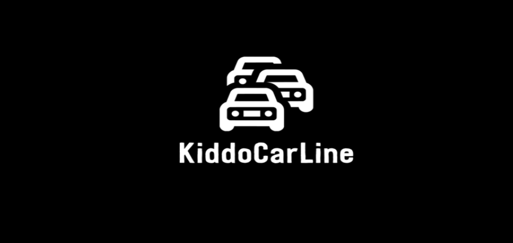
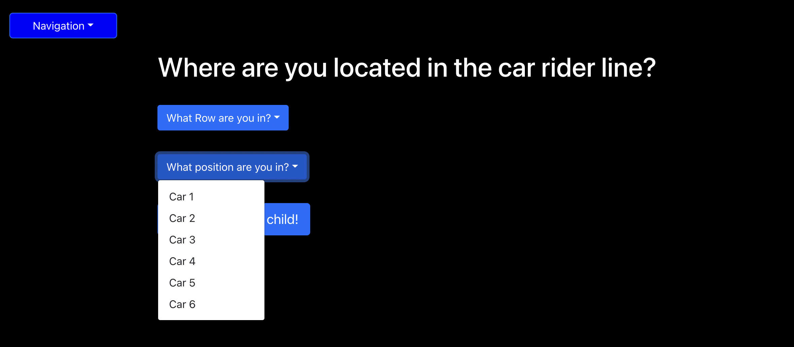

# Kiddo Car Line

Kiddo Car Line is a web application that allows parent to inform the school when they are here to pick up their child. 

[Live Site!]()

## Description

- The creation of this project was motivated by fixing a problem that started due to the Covid pandemic. More parents were driving their children to school instead of riding the bus.  This caused an abundance of car riders. To help speed up the car rider line this app allows the parents to notify the school when they have arrived and then the students can quickly be loaded into the cars.

- We built this project to help schools and parents efficiently utilize a car rider line and get the families off to their next destination.

- In working on this project, we learned how to collaborate as a group, compromise on ideas, resolve Git conflicts, and prioritize tasks for deadlines.

## Table of Contents
  - [Description](#description)
  - [Table of Contents](#table-of-contents)
  - [Installation](#installation)
  - [Usage](#usage)
  - [Credits](#credits)
  - [License](#license)

## Installation

1. Provided that you have a code editor of your choosing installed on your system, such as VS Code (https://code.visualstudio.com/),

2. Provided that you have a Terminal installed for Windows (https://www.microsoft.com/en-us/p/windows-terminal/9n0dx20hk701?rtc=1&activetab=pivot:overviewtab) or are using a Mac with Terminal installed with the OS,

3. Provided you have Git and Github Desktop installed (https://git-scm.com/downloads, https://desktop.github.com/) and have registered for an account,

4. Either Clone or Fork this repository: git clone (https://github.com/cbeard22/kiddocarline.git)

5. Create your own repository for the files on GitHub.

6. Edit to your liking and continue to commit, push changes and perform other Git actions using your repository (https://docs.gitlab.com/ee/gitlab-basics/start-using-git.html).

7. Deploy this repo to heroku (https://id.heroku.com/login)

## Usage
To utilize this page, simply create an account on the sign up page. Then login and select that you are here to pick up your child. Your childs name will then be loaded into the car rider line administration page where the teachers can display or dismiss students to go to the car rider line. Once the cars are full the admin can then clear the car rider lines and they can begin to enter new names. 

## Credits
- Collaborators
  - [Jeff Severson](https://github.com/jeffseverson2001)
  - [Chris Beard](https://github.com/cbeard22)
  - [Mike Steinmetz](https://github.com/mgsteinmetz)
  - [Daniel Klauer](https://github.com/danielkl12)
  - [Derek Vangstad](https://github.com/Dvangstad)

  - For this project we utilized:
  - Javascript
  - GraphQL
  - React
  - Mongoose ODM
  - Heroku
  - Node.js
  - MongoDb
  - Apollo
  - React-Bootstrap
  - JWT Authentication

- Tutorials Followed:
[Professional README guide template provided by Coding Boot Camp.](https://github.com/coding-boot-camp)

## License
- MIT License

- Copyright (c) [2021] [Jeff Severson ; Chris Beard; Mike Steinmetz; Daniel Klauer; Derek Vangstad]

- Permission is hereby granted, free of charge, to any person obtaining a copy
of this software and associated documentation files (the "Software"), to deal
in the Software without restriction, including without limitation the rights
to use, copy, modify, merge, publish, distribute, sublicense, and/or sell
copies of the Software, and to permit persons to whom the Software is
furnished to do so, subject to the following conditions:

- The above copyright notice and this permission notice shall be included in all
copies or substantial portions of the Software.

- THE SOFTWARE IS PROVIDED "AS IS", WITHOUT WARRANTY OF ANY KIND, EXPRESS OR
IMPLIED, INCLUDING BUT NOT LIMITED TO THE WARRANTIES OF MERCHANTABILITY,
FITNESS FOR A PARTICULAR PURPOSE AND NONINFRINGEMENT. IN NO EVENT SHALL THE
AUTHORS OR COPYRIGHT HOLDERS BE LIABLE FOR ANY CLAIM, DAMAGES OR OTHER
LIABILITY, WHETHER IN AN ACTION OF CONTRACT, TORT OR OTHERWISE, ARISING FROM,
OUT OF OR IN CONNECTION WITH THE SOFTWARE OR THE USE OR OTHER DEALINGS IN THE
SOFTWARE.
